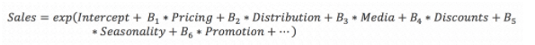
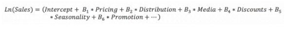
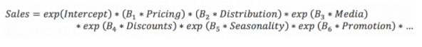
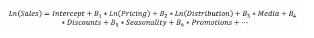

# Marketing Mix Modeling

### Background and Use Cases

The purpose of MMM is to drive media spending decisions by providing a)
an estimate the short-term impact of Media executions on a KPI, b)
relate this to the cost of media \[ROI or Cost per KPI\] and c) estimate
the likely outcome of future spends \[using Response Curves, see Media
Optimization \]

MMM is a decision-support analysis, so timing should be aligned to media
decisions. 1. Some companies seek to time the data cutoff of a model to
cover a certain campaign performance; often, this doesnt align with
decisioning and delivers models too late to be effective 2. Backwards
plan from media decision points to determine when to model 3. Number of
annual decision points (along with budgets) determine the number of
models to be run each year (and might have implications on modeling
approach; if a monthly model is required then Bayesian approaches might
be appropriate).

MMM is the one analysis that can include almost all media channels in
the analysis. This is because MMM runs at a level of aggregation that
aligns to how much of media is purchased. It is also the only media
analysis that considers seasonality, business cycle and environmental
variables to create a strong estimate of what a company’s business would
be without media because of the time-scale of the data (usually 2 years,
sometimes longer for Long Term Effects Model)

### Media Data (US)

#### Linear and Digital Television (TV)

1.  *Linear TV* Data is generally provided at a DMA / week level,
    sometimes at ZIP code 1. DMA = Designated Market Area. DMAs were
    created by Nielsen when they created their media their TV viewership
    service. They are created at the county level around major metro
    areas and roughly correspond to

2.  Agencies will often provide GRP (gross rating point) data, but
    should provide Impressions if at all possible. Alternatively, Reach
    can be modeled instead of Impressions

    1.  GRP is a composite metric of % Reach x Frequency 1. Comparison:

    -   50% Reach delivered 1 time = 50 GRP
    -   25% Reach delivered 2 times = 50 GRP
    -   12.5% Reach delivered 4 times = 50 GRP

    1.  In Nielsen data, GRPs are calculated at the National and
        Clearance level
        -   National GRPs should not be used for modeling unless you are
            doing a Natoinal OLS model; at that level a GRP is the % of the
            National Reach x Frequency. At a DMA level, National GRPs
            are null
        -   Clearance GRPs are calculated at the DMA level, so the %
            Reach is the percent of the DMA's population. National GRPs
            will report as null at the DMA level, while Clearance will
            be reported
        -   If agencies do not provide Impressions then they should
            provide DMA Population for targeted population so GRPs can
            be converted to impressions
        -   Impressions = GRP / 100 x DMA Population

3.  TV data is broken in multiple ways (Nielsen data used here as the
    standard, providers like comScore and iSpot provide similar breaks)

    1.  Advertiser - the company that paid for the ad
    2.  Brand which brand was advertised. The Hershey Company might be
        an Advertiser while Reese’s might be the brand
    3.  Daypart - when the ad aired. While Post Log data will provide
        you the Date / Hour / Minute / Second the ad ran, aggregated
        media reporting will bucket into  

    -   Morning: 6-9AM
    -   Daytime: 9AM-4PM
    -   Early Fringe 4PM-7PM except for News
    -   Evening News: News programming during 4-7 time-slot
    -   Prime Access: 7-8PM Mon-Sat; there is no Prime Access on Sunday
    -   Prime: 8-11PM, except on Sunday it is 7-11PM
    -   Late News: 11-11:30PM
    -   Late Fringe: 11:30-1AM
    -   Overnight: 1-6AM
    -   Total Day: This is for Syndicated TV when Daypart is not
        collected

    1.  Network Type the data will come out split by Network type in
        columns
        1.  Network this is defined as programming on NBC, ABC, CBS and
            Fox that is provided by the Network (not local programming
            provided on affiliate stations). Network TV is purchased two
            ways,
            -   Upfront is purchased at a discount sold at meetings
                \~June of each year where the upcoming Fall lineup of
                shows is announced; increases in Digital Video are
                causing Advertisers to move away from this practice.
                They want Linear to behave more nimbly, like Digital
                channels. The advantage for Advertisers in the Upfront
                is that they pay a discount for what they expect to be
                highly rated shows; the risk is that the shows don’t
                deliver an audience.
            -   Scatter is Network TV that is purchased after the
                Upfront period; it is the fragments of spots available
                after the Upfront is complete, and comes at a higher
                cost
            -   Upfront and Scatter is NOT differentiated in Impression
                or GRP data, but you will see cost differences.
        2.  Cable is Linear TV delivered on networks other than Network
            (with come exception, see below). Cable TV is generally only
            available at a National level; impressions need to be
            allocated to DMA based on population. While Cable data is
            often delivered with Daypart detail it is not purchased by
            Daypart so it is almost never analyzed by Daypart.
        3.  Syndicated represents reruns or original content that is
            sold to local stations to fill in time periods where there
            is no Network programming, or to provide content to local
            stations with no network affiliation. With Syndicated an
            Advertiser purchases a show rather than a time of day; it
            can run at different times (or even multiple times) a day
            and vary across markets. As such, Syndicated often has a
            Daypart of Total Day (non-specific) but occasionally Daypart
            detail is provided; like Cable, the Daypart is not terribly
            meaningful
        4.  Spanish Language TV describes placements on networks like
            Telemundo. Television spots are almost always in Spanish.
    2.  Cost Nielsen data often includes Cost data, but it is Nielsen’s
        estimate of Cost; it should be ignored in favor of

4.  *Connected TV / Over the Top (OTT) / TV Online (TVO)* are TV content
    delivered using services like ESPN Plus, Hulu, Roku, YouTube TV,
    etc.. Advertising here is often Addressable (see below), so is more
    effective. It is also often cheaper. Data for this generally comes
    in a simplified form (DMA, Week, Campaign, Impressions, Actual
    Cost).

5.  *Addressable TV* is delivered via TV providers like DirecTV, Comcast
    and AT&T. The provider creates audiences of individuals based on
    demographics or buying behavior (if integrated with surveys or
    panels) to create specific audiences (example pet owners) to reduce
    ad waste. Impressions tend to be much more expensive but are often
    much more effective due to the precise targeting. Similar to OTT,
    the data here tends to be very simple (DMA, Week, Campaign,
    Impressions, Actual Cost).

#### Display and Digital Video

1.  Display consists of banner ads that are delivered on web pages
2.  Digital Video is similarly delivered on web pages, but has Video
    content rather than static images like Display.
3.  When pulling this data, agency and clients can default to very
    granular data pulls that provide far more detail than is required;
    often, reporting with just DMA, Week, Campaign, Impressions, Clicks
    and Cost can be pulled, but often large datasets with excessive
    granularity are all some agency analysts know how to pull, and so
    must be manually aggregated prior to modeling. Breaks in the data
    should be provided (included in Campaign or supplied instead of)
    that reflect targeting / audience approaches; this will allow for
    analysis against these later
4.  When modeling, Impressions is usually the independent variable used.

#### Paid Social

1.  This covers paid advertising on sites like Facebook, Pinterest,
    Twitter, LinkedIn 2.Content can be either static ads (like Display)
    or video
2.  Like Display and Video, standard data delivery is DMA, Week,
    Impressions, Clicks Campaign and Cost; however, the data may come
    with extra, unnecessary detail.
3.  When modeling, Impressions is usually the independent variable used.
4.  Other variables like Engagements might be added; these can be used
    to interpret campaign results.

#### Paid Search

1.  Search is a service provided by companies like Google and Bing that
    leverages algorithms to match a request for information to web sites
    that might possess information on that topic. The results returned
    are ordered based on relevance to what was searched for.

2.  Companies can pay the Search providers to get preferential ordering
    in the results that the Search algorithm returns to a user, so
    instead of being purely based on relevance instead certain Paid
    terms come first, followed by the remaining Search results (called
    Organic).

3.  There are three types of Paid Search

    -   Branded Search the search terms purchased here are very few; the
        Brands name and any associated taglines or phrases associated
        with the brand
        -   “good to the last drop”
        -   “I’m worth it”
    -   Unbranded Search this is a much longer list of terms associated
        with the brand. For the Brand Maxwell House, branded terms would
        be Maxwell House and Good to the Last Drop. Unbranded terms
        would be coffee, morning, breakfast, caffeine, coffee maker,
        pick me up, etc…
    -   Competitive Conquest Search this is the practice of buying
        another company’s branded terms. In our example, if Maxwell
        House bought keywords like “Folgers” and “Dunkin” then that
        would be Competitive Conquest Search

4.  Costs When you look at the Cost per 1,000 Impressions (CPM) for
    Display, Video and Social, you will not a correlation between the
    cost and the quality of the placement. So if a company wanted to do
    a page takeover of CNN, this would mean every display and video
    location on that page would be that company’s ads; these are
    effective buy costly. For Search, the cost of a term has nothing to
    do with the quality of placement but everything to do with how many
    people are trying to buy that term. The more players on a term, the
    higher the price goes as companies out-bid each other.

    -   If a brand is in a space that is not especially competitive,
        then Search will be relatively inexpensive.
    -   Some spaces that are incredibly competitive are therapeutic
        spaces in pharma 1. Every brand is bidding on essentially the
        same Nonbranded terms, making these more expensive
    -   Every brand is also bidding up each others Branded terms; in
        many cases, if you search for Brand A you will see Brand B show
        up first because they bid higher for Brand As term.

    *Google Display Network (GDN)* muddying the waters is GDN; if
    somebody pulls Google Search data, it might include GDN. It would be
    an easy mistake to include this in Search, but this is Display; this
    might lead to contention as one team might buy Search and another
    Display (and one of those teams might work for the brand team while
    one works for an agency partner). That said, the model will need to
    use different transformations for Search and Display, so GDN must be
    separated; this might have implications as to how submodeling for
    Display is designed.

#### Additional Topics

**Organic Social and Search**

1.  Organic Social is simply mentions of your brand on social media by
    people who are not compensated to do so. Their comments might be
    positive or negative (Sentiment Analysis can examine this)
2.  Organic Search is exactly the same as Paid Search, but in this case
    people simply clicked on a link that came up below Paid links in the
    Search results/
3.  Many companies like to include this “earned” media in Marketing Mix
    Models; our general position on this is we dont agree with
    including, as there is no way to affect Organic activity and no
    Spend to optimize, so adding this data to the MMM adds complexity
    without supporting any decisions.

**Out of Home** - this includes signage on billboards, electronic
billboards, kiosks, subway signs, etc. Data for this usually comes in at
a DMA level, but as a simple estimate of average weekly impressions for
a period in time as there is no way to measure the people who see a
sign. Because of this, OOH is notoriously difficult to include in a
model (as there is no change in weekly impressions, so there is no
relationship between change in impressions and change in KPI for the
model to detect)

**Direct Mail and Email (DM & EM)**

1.  DM is postal mail sent either addressably or in bulk to drive action
    by customers. Data for this is often for MMM at a ZIP Week level
    with total Mail sends and the corresponding cost (it may have
    Campaign or other detail)
2.  EM is electronic mail sent addressably using either 1P data or by
    purchase of lists. Some companies are able to provide geographic
    detail for EM recipients, but most are not. EM is almost cost-free;
    depending on the use case, it is most often not part of MMM but is
    examined using Individual MTA.

**Public Relations (PR)** a surprisingly large number of online
articles, blog posts, newspaper articles and videos are actually created
by paid PR firms / freelancers. These are almost always positive event
notifications or spin to mitigate a negative event. PR firms generally
do not do a great job collection data on these, but the good ones can
give DMA / week Impression and Cost data.

**Influencer** - this is generally limited to fashion / fad driven
industries. Some individuals have very large online followings for their
social media and / or blog sites. Companies pay them to deliver positive
online messages about their brands; this might be video experiencing a
meal, a hotel stay or a vacation destination, a post extolling the
benefits of a beauty care product or the like. Most Influencers do not
provide data about their activities; most common data is simply a list
of dates where Influencers were active and maybe Retweet activity or the
like.

**Industry-specific data** - this covers things like Sales Force
activities in Pharma, out-of-stock and merchandising data in retail &
CPG, or similar factors that must be controlled for in the model without
being marketing channels. These data usually have continuous data that
can be expressed at the DMA / week level, without which the model would
be biased (if Pharma reps were not controlled for then marketing would
be overstated in an MMM).

**Events** - this is a catch all category. Many times there are events
that impact our KPI which are not explained by continuous data. Example
weather data may not be significant in a given model, but a storm that
cut off power in several markets for a week might cause a measurable
effect and properly controlled for with a flag variable in those
markets. Determining these is a collaboration between business owners
and modelers.

**Competitive Media / Share of Voice** - including some impact from
competitive media makes intuitive sense; however, reality is very often
more complex. For a company to even bother to run a MMM, they likely
have considerable media spend; they are also likely in a competitive
business, so competition also spends on media. Because of this, we often
find these terms to be too collinear to exist in the model 1. SoV is
highly correlated with our media terms (as our media is the numerator of
the SoV ratio) 2. Competitive media often flights very similarly to our
media (since subject to the same seasonality and business trends) and so
is highly correlated with our media 3. Category Models are a potential
solution here; they only

**DMA Mapping** - while DMA may be standard across many platforms, some
platforms only include DMA Name and not DMA number. Often, DMA Name
differs across platforms, requiring some mapping to be done. The only
real solve for this is hands-on reconciliation on a case by case basis

### Base Effects

#### Overview

MMM recognizes that there are some effects which are not media driven
and which cannot be explained by short-term media data. *Base or
Baseline* is the value of a given brand or product in the context of its
competitive position in the market and the accumulated equity it has in
the mind of its customers. For example, you may not see a single ad for
Snickers in a two year period, but if you aware of it, you know what its
benefits are and you encounter it on the shelf then you might purchase
it to fit a need; this purchase would be a “Base” purchase. Similarly,
if a pharma drug launches after years of highly public clinical research
then doctors may write Rx for it on Day 1 without having seen an ad or
having been spoken about it by a sales rep; this, too, is a Base effect.

#### Base Variables

In MMM, we seek to estimate the Base and changes in the Base in several
ways. While MMM is a cross-sectional analysis, it borrows some concepts
from time-series analysis to explain changes across the panel of data.

**Linear Trend** A straight line fit to the data points to explain the
overall pattern of the data. Isolated cases may require the use of
custom, non-linear trends to be created manually by modelers, say for
product launches or dramatic marketplace changes.

**Seasonality** Seasonality in a time series is a regular pattern in the
data that repeats itself. There are different ways to estimate
Seasonality

-   Time-series decomposition - this uses time-series approaches to
    estimate what portion of the KPI is driven by our recurring seasonal
    pattern. Facebook’s Robyn approach uses Prophet to estimate Trend
    and Seasonality, then runs a Ridge Regression model against the
    residual
-   Index - this is simple approach where each week is numbered 1-52 and
    the KPI for that week is divided by the average of all weeks, then
    multiplied by 100. If multiple years of data are used then results
    are averaged across week numbers; 53 week years can add some
    complexity, but can be worked around
-   Fourier Waves - [from Toward Data
    Science](https://towardsdatascience.com/analyzing-seasonality-with-fourier-transforms-using-python-scipy-bb46945a23d3%20%22ttps://towardsdatascience.com/analyzing-seasonality-with-fourier-transforms-using-python-scipy-bb46945a23d3%22%22)
    -   "The Fourier transform allows you to transform a function of
        time and signal into a function of frequency and power. This
        tells you what frequencies make up your signal and how strong
        they are. In our case, the signal is the number of phone calls
        and we might be expecting some kind of weekly or daily
        frequencies.  Real data often contains noise and the Fourier
        transform lets us see through the noise, and see which
        frequencies actually matter”

    -   With Fourier Waves, you fit sin and cos transformations as pairs
        to estimate seasonality.  Tools like Fast Fourier Transform
        (scipy: fft) can be used to estimate these waves
-   Holidays - these are estimated using indicator or flag variables. 
    Some holidays may require multi-week indicators (example - some
    companies shut down for the month of December).

**Environmental Variables** - the case for including environmental
variables like Gas Prices or Interest Rates seems compelling on the
surface, as the likelihood of a statistically significant relationship
between your KPI and environmental terms may seem high. However, they
should only be added when there is a clear and compelling case to do so
(such as including temperature in a model of Ice Cream sales). The
reasons are two-fold and related

-   While interesting, nothing can be done to control these terms. MMM
    is about decision support, so adding extra terms that can’t be
    decisioned on just to increase R-Sq doesn’t make business sense

-   Adding these terms makes our model less parsimonious, and create the
    risk of overfitting and / or impacting our ability to measure media
    impacts.

-   Data sources for environmental variables:

    -   Gas Prices: DOE good source for these: [Link]
       (https://www.eia.gov/dnav/pet/hist/LeafHandler.ashx?n=PET&s=EMM_EPMR_PTE_NUS_DPG&f=W)
        Note that DOE does have geographical granularity, but it custom
        and so needs mapping to markets

    -   Prime Rate

    -   CPI

    -   Weather

**Price Variables**

Price analytics are a non-trivial exercise; the customer relationship
with Price is a complex one and can have a lot of industry-specific
dynamics. In some industries, like pharma, Price is a second-order
effect and not a modeled term; in others like CPG price can have many
components, such as

-   Non-promoted Price Elasticity

-   Non-promoted Price Thresholds

-   Non-promoted Price Gaps v Competition

-   Promoted Price Elasticity

-   Promoted Price Thresholds

-   Promoted Price Gaps

-   Multiples

-   Merchandising Conditions

These are a lot of terms to add to a MMM! Especially when the purpose of
the MMM is to measure Marketing…

Also, note that Elasticity implies a multiplicative form, but MMM more
often uses an additive form because it is easier to decompose.

For these reasons, Price variables are better used as control variables
in an MMM, but real analytics of Price generally require a separate
dedicated model.

### Data Transformations

**Overview** - transforming data for modeling is nothing new, but for
MMM it takes on a different dynamic. In MMM, transformations are used to
assess the time-phased effects of media, as media will inform, educate
and remind customers of a product’s attributes & benefits while also
creating affinity with the brand. That’s a lot of work to do, so brands
use multiple media channels with campaigns targeted against specific
audiences to achieve specific outcomes.

When considering media transformations, it is common for brands to think
of a single impression, as if the transformation is estimating how a
customer reacts to a single ad (they see the ad in week 1, are most
likely to respond in week 3, less so in week 4 and there’s no response
by week 6). The problem with this construct is that it ignores that
somebody might see a TV ad in week 1, a Display ad later that week, then
another TV ad in week 3 followed by a Search click in week 4 where they
ultimately buy. Care must be given not to oversimplify what media
transformations do.

Transformations are channel specific, with longer transformations going
to channels with more engagement (as measured by market research on how
attentive customers are with channels). Some examples:

-   Television - tends to have a longer transformation (effect might
    last 8-13 weeks, but with a maximum effect in weeks 1-3) because
    people choose to be attentive to TV (say for a football game)

-   Video - similar to TV (in many cases, engagement is forced, such as
    for in-stream), but shorter duration

-   Other Digital channels - tend to have very short transformations
    (but Social might be more like Video if that is the content served).
    Display tends to have very short transformations.

    -   Paid Search is often a “fulfillment channel” because customers
        don’t type in full URLs but Search on their way to purchase.
        Because of this dynamic, Paid Search is often examined for
        transference in secondary models (did TV drive the Paid Search
        clicks that drove the Sale?)

-   DM / EM - these will be very model-specific as the engagement can
    vary. Example - for time-bound purchases like insurance Open
    Enrollment, early DM can tee up sales that come in at the last
    minute (calls to 800 numbers on DM demonstrate this)

-   Print - this channel is really limited to luxury / fashion goods
    now, but research shows very long transformations as glossy
    magazines tend to be retained for a long time

When modeling using these transformations, a best practice is to create
many different transformations for each variable and then use a Grid
Search approach to focus in on the most appropriate transformations.

Some transformation approaches include:

-   **Adstock** - as proposed by Simon Broadbent in 1979, the Broadbent
    formula is

    *At = Tt +* λ*At-1 t*=1,…., n where Tt is a measure of advertising
    weight (e.g. GRP) in time t. λ is a memory decay speed and *At-1* is
    advertising weight in t-1. ([Adstock
    Reference](https://medium.com/@Marko_Mi/advertising-adstock-theory-85cc9e26ea0e)).
    This is a simple decay that assumes recency is most important (you
    are more likely to respond to an ad today then next week, but you
    might act next week based on your memory of an ad today)

-   **Power** - consider that advertising has two components, Reach (the
    number of people who see the ad) and Frequency (how often they see
    the ad over a period of time). The very first impression bought is
    assumed to reach your most important customers; each impression
    added thereafter within a period of time adds fewer target customers
    and add more frequency. Power describes the diminishing returns of
    media as media shifts from adding reach to adding frequency (and
    ultimately too much frequency, causing customers to ignore ads)

-   **Lag** - this describes structural market dynamic that might cause
    a delay between when a customer wants to respond to an advertisement
    and when they actually can. An example might be the lag between
    seeing an ad for a medication and being able see your doctor (which
    might take weeks)

-   APL (Adstock Power Lag) is the oldest MMM transformation that
    combines these three methods; it is simple, easy to understand and
    implement.

-   More flexible transformations allow for more complex relationships;
    they can also approximate simple Adstock. These include (and are
    used in conjunction with Power) and have the key advantages of being
    able to estimate media effect and saturation in a single variable:

    -   **Gamma -** this leverages the probability distribution
        functions of gamma distributions. When building the
        transformations, we configure as follows

        -   Length of the transformation - standards are 6, 13 or 26
            weeks. 6 is usually used for Digital media, 13 for TV and
            Video, 26 for Print or industry-specific terms

        -   The highest single week effect

        -   The week where that maximum week effect is reached

    -   **Weibull -** [GitHub Review from
        Annalect](https://github.com/annalectnl/weibull-adstock/blob/master/adstock_weibull_annalect.pdf)
        This curve is similar to Gamma, is used by Facebook’s Robyn

### Model Functional Forms

**Additive** - the most common approach, it has it’s foundation in the
basics of linear regression. Each media channel is a variable with a
coefficient, as shown below

*y* = *β*0 + *β*1*x*1 + *β*2*x*2... + *e*

The key advantages to additive models are that

-   they are intuitive

-   they are easy to estimate

-   they are easy to decompose

Disadvantages

-   Generally depend on consistent variance over the panel of data

-   Do not account for media interactions well (but interactions are
    generally only interesting, not actionable)

**Multiplicative** - these are best suited for instances where variance
changes greatly over time.

*y* = *β*0 \* *β*1*x*1 \* *β*2*x*2... + *e*

Key advantages include the ability to handle situations where variance
changes over time (such as a product launch that creates a new category)
and the ability to account for the interation of media.

Disadvantages include difficulty using complex transformations,
difficulty decomposing the model and difficulty interpretting media
interactions (did TV drive Search or did Search drive TV?)

this reference provides an overly complex (3 model!) estimation MMM
using a multiplicative approach [MMM Stan
Link](https://github.com/sibylhe/mmm_stan)

Given the difficulties with Multiplicative forms, these are often
expressed logarithmically

**Log-Linear** - here ” the exponents of independent variables are
multiplied.

![image] (paste-CF8EA2DB.png)

This can also be rewritten as:

Logarithmic transformation of the target variable linearizes the model
form, which in turn can be estimated as an additive model. The dependent
variable is logarithmic transformed; this is the only difference between
additive models and semi-logarithmic models.

In Log-Linear models, the coefficients β are interpreted as the % change
in business outcome (sales) for a unit change in the independent
variables (e.g. pricing, distribution, media, discounts, seasonality,
promotion, etc.).

**Logarithmic Models**

In Log-Log models, independent variables are also subjected to
logarithmic transformation in addition to the target variable.

Rewriting the model in linear form:

The main difference between Log-Linear and Log-Log models lies in the
interpretation of response coefficients. In Log-Log models, the
coefficients β are interpreted as the % change in business outcome
(sales) in response to a 1% change in the independent variable:

This implies constant elasticity of the target variable with respect to
the explanatory variables. In Log-Linear models, elasticity cannot be
directly estimated but can be calculated from the coefficient as βX for
every time period. It increases in absolute value with the explanatory
variable.” -
[Reference](https://www.spencertom.com/2020/08/29/marketing-mix-modeling-mmm-part-3-of-3/)

### General Process

Project timelines can vary greatly, but a general modeling process
follows this flow

-   **Specification** - this is determining what decisions need to be
    supported, when analysis needs to support those decisions, what
    resources are available (data, data scientists, stakeholders) and
    what gaps need to be closed.

-   **Kickoff** - here all stakeholders are gathered, including outside
    partners with data to provide and points of view, to begin the
    process. Resources and timelines are reviewed, data gathering
    commences.

-   **Exploratory Data Analysis (EDA)** - as data is gathered, the data
    science team checks the data for errors and completeness. The team
    also examines for outliers and potentially influential data points.
    Once all the data is gathered and processed, all stakeholders meet
    to review the data and align on it being complete, comprehensive of
    the scope of the brand’s marketing, includes key data around events
    and other items that affected the KPI and, most importantly, is
    accurate This is a key step that should not be taken lightly; if
    errors or missing data are not found, then the model might not be
    valid and insights won’t be delivered in time to affect decisions.
    Some organizations go to the extreme step of requiring a digital
    signature by all stakeholders before modeling can begin. EDA
    generally ocurrs within two weeks of the data science team receiving
    all data

-   **Initial Model Estimation -** the data science team conducts
    modeling, iterating through combinations of variables and leveraging
    tools such as Grid Search to find the model that a) is statistically
    robust, and b) does the best job explaining the business situation.
    Outputs of this step are each channel’s contribution to the KPI,
    calculation of efficiency metrics (ROI, Cost Per KPI) and a review
    of model diagnostics (examples - ANOVA, MAPE, R-Sq, Durbin Watson,
    Condition Index, Jarque-Bera Test, Fit Chart). This phase generally
    takes 2-3 weeks for an experienced data scientist

-   **Secondary Analysis -** If detailed sub-channel data is available
    then analysis of that is conducted, as well as ad hoc analysis.
    Response curve development to estimate the likely effects of future
    spends and baseline forecast are also conducted. Model results and
    insights are consolidated into a presentation for key stakeholders.
    Best practices show that a review of results with a Core team
    (including media agency partners) prior to sharing with the full
    team leads to better insights and better adoption of the process.
    This phase takes about two weeks.

-   **Simulation / Optimization -** in this iterative phase, the data
    science and brand / agency teams collaborate on potential media
    plans and what their likely outcomes are. Tools supporting this
    range from simple Excel tools to online SaaS environments.

-   **Model Maintenance / Production -** modeling data and code files
    are maintained, unnecessary files are deleted, process improvement
    plans are put in place. If the model is frequently updated (monthly)
    then the model code is put into production, is connected to data
    feeds and dashboards are populated.

### Common Methodologies

**Hierarchical / Mixed Regression -** this is considered the standard
approach for US MMM; the model assumes that there are fixed an random
effects for some model terms. These terms can be random by geography
(DMA) or over time. The random effect is a deviation from the fixed
effect, so the model accounts for differences in media response across
DMAs. In most cases, the intercept is randomized to account for
differences in market size but most media terms are not randomized.
<u>*How To: Code, Data & Details*</u>

**Ordinary Least Squares (OLS) -** this is very simple regression when
DMA level detail is not available. It is extremly limited in its ability
to estimate effects, especially below channel level, due to limited
observations. <u>*How To: Code, Data & Details*</u>

**Constrained (Bayesian / Hierarchical Bayesian)** - follows a similar
approach as regression models, but estimates are constrained a priori
based on modeler’s judgement. Some organizations use this as their
default approach; while advantageous in terms of speed to delivery, it
is akin to deciding what the answer is before asking the question \[and
begs the question “if you decide what the answer is before you model,
then why even model?”\] One application for Bayesian models is for
subsequent modeling of components of a dependent; for example, for a
brand you might model Total US Retail using an unconstrained model, but
then use the results from that model as priors in a Bayesian model of
different types of retailers. Another application is for frequent
updates - if a brand wants monthly updates of their model, there is
simply not enough time to run a fully specified model every month. A
company can build a deliberate, unconstrained model and then use the
results from that as inputs to a constrained model that runs monthly.
Deliberate rebuilds of this model are conducted annually (unless
constrained model updates show that the priors no longer describe the
market conditions and need to be updates).

**Subset Regression** -
[Reference](https://online.stat.psu.edu/stat501/lesson/10/10.3) Subset
regression is not really an MMM method, but it is a method to determine
what variables are the best candidates in a MMM. The approach examines
all the different combinations of variables in a dataset and compares
them using RSq, Adj Rsq, MSE, Mallows Cp and Predicted RSq. <u>*How To:
Code, Data & Details*</u>

**Multi-Model Approaches -** the common thread with these approaches are
to use one model (often a time-series model) to isolate the Base, then
to run another model against the residuals of that model. Examples
include this PyStan model noted above (which uses Hill Curve for media
optimization) [MMM Stan Link](https://github.com/sibylhe/mmm_stan), and
Facebook’s <a href="https://github.com/facebookexperimental/Robyn"
class="uri">Robyn</a>, which uses Prophet for it’s Base model, Weibull
curves to transform media and then Ridge Regression for the residual
(note- runs at national level).

**Time-Series Approaches -** time-series, like multi-model approaches,
are viable for MMM but not preferred. The reason why is the way that
media is flighted; marketers know when their peak seasonality is, so
they flight media to align to that (as it is also their competition’s
peak season). If seasonality is complete removed first using a TS
approach then some of the media effect is removed before media is even
evaluated.

-   Vector Autoregression with Exogenous Variables (VARx) - a niche
    consulting firm,
    <a href="https://mproductivity.wordpress.com/tag/vector-autoregression/"
    class="uri">MPG</a>, uses this approach for a small base of
    customers, claiming that it helps isolate media interactions

-   Unobserved Components Model (UCM) - similar to VARx, some boutiques
    use this form. Some claim that it can isolate the Brand Equity as
    the “unobserved component”
    <a href="https://market.science/dynamic-marketing-mix-modeling/"
    class="uri">UCM</a>

**Agent-Based Modeling** - this approach took the CPG space by storm in
the early 2010’s thanks to a firm called ThinkVine. The idea is that the
model creates a simulation of “agents” who represent a brand’s
customers. The model then enters media into the simulation space to see
how the agents respond to it; their response then estimates media’s
performance. As a concept, it made a ton of sense to brand marketers;
the challenge with it is that it is a “black box” model; once the data
is provided, the model provides an estimate with no diagnostics. When
subsequent models provide VERY different estimates, there is no way to
understand why results changed. The method has fallen out of favor for
MMM, but still has applications. [UPenn
Reference](https://repository.upenn.edu/curej/109/)

# Aggregate Attribution

### Background and Use Cases

Attribution, in general, seeks to provide insights on a more granular
basis than MMM. While the primary users of MMM are brand teams / budget
owners who use it to make operational decisions, the primary users of
Attribution models are media buyers. They consume the results of
Attribution on a frequent basis to change their media buys based on the
latest model results. To accomplish this, results must be delivered at a
Placement or Campaign level and must be delivered frequently.

### Data

Unlike MMM, Attribution methods require data feeds to be established to
ensure automated, unimpeded access to the most recent data. Data sources
most often tend to be Digital media like Display and Video (via DV360
and Innovid), Social (via walled-garden data feeds) and Search (from SA
360 and other engines like Bing). Feeds to data for the dependent
variable must also be automated so data is always available (often Site
Visits is used). An estimate of the worth of a Site Visit is created
before modeling to enable ROI calculation. Metadata relating executions
to campaign and cost is vital.

### Data Transformations

Data tends not to be transformed in this process, as very short
timescales are used

### General Process

There are three approaches that fall under the heading of Aggregate
Attribution; their processes differ a little.

*TV Attribution* - the intent of this analysis is to gain more
granularity of insights for TV campaigns. The dependent variable is most
often Site Visits (especially in situations were Direct Response TV is
used) but can be Search clicks. TV data is derived from post-logs, which
provided detailed information on exactly when commercials ran and during
which programs on which stations. A baseline of expected Site Visits is
established, then the visits above that baseline are isolated and
related to incremental Site Visits. TV Spots are then related to the
visits that are driven by them in terms of Impressions (if provided in
the post log) and ROI. The availability of TV post logs varies by media
agency - monthly is most frequent, but some only receive quarterly

*Segmented Site Attribution* - similar to TV Attribution, this approach
uses an expected level of Site Visits and then examines how increases
above expected visits relate to marketing activity. The approach is
termed “segmented” because the Site data can be broken into segments
based on data like Referring URL, DMA, etc, to relate it to media data.
Because all of the data for this method is digital (Site Visits &
Digital media) the data uses daily data feeds and the models are updated
each week.

*Walled Garden Cohort Attribution* - the term “walled garden” refers to
sites like Facebook where aggregate data is available but data at an
individual level (for use in MTA) is not. \[need help on this one\]

### Common Methodologies

Ensemble forecasting methodologies might be used, or a tool like
Prophet, to create the baseline of expected visits. Loess smoothing is
also a useful methodology.

# Customer Journey Analytics

### Background and Use Cases

The intent and use cases for Customer Journey Analytics are very similar
to Aggregated Attribution; however the data used is very different and
allows for greater depth of understanding. While Segmented Site
Attribution allows understanding of which campaigns are performing best,
it uses Site Traffic as a proxy and uses aggregate data. Customer
Journey ties individual data to outcomes and shows results at an
individual level so media campaigns can be optimized by audience.

Attribution methodologies have a limited view of marketing data, and
their short timescale aligns with their purpose (show which campaign is
performing best to enable placement optimization, not to enable
cross-channel optimization). This requires that results be calibrated to
MMM (which contains all marketing channels and a longer, more complete
view of how customers engage with media).

There are a few different types of Customer Journey Analytics:

*Nonmodeled Touch Analysis* - this is the oldest attribution methodology because it is the simplest. Most often, either the last click prior to conversion is given full credit for that conversion; sometimes, credit is given to the first click or is apportioned evenly to all clicks.  No time-decay or machine learning is used.  While easy to implement, it paints an innacurate picture of conversions

*Multitouch Attribution (MTA) -* individual digital media touchpoints
are tied together in a clean room using Identity Resolution data to show
how individuals received media and how that media led to conversions.

*Walled Garden Clean Rooms* - similar to MTA, but in these cases a
partner like Google or Facebook will provide a clean room with their own
identity solution built-in. This is an evolving capability in the face
of cookie deprecation; one key advantage is the ability to directly
connect model results to activation in that platform.

*Customer Relationship Management (CRM) Attribution -* this approach
uses the same methodologies as MTA but is limited to data that has
direct first-part data (generally Direct Mail, EMail and Call Center).

*Healthcare Provider (HCP) Attribution -* instead of involving media
data, this uses data on pharmaceutical sales reps and their sales
activities with HCP to drive adoption the prescription (Rx) writing. The
challenge with this model is that it focuses less on discrete conversion
events and more at changes in writing behavior (so what sales calls
drive higher Rx writing?) Also, we tend to see in-person sales calls are
almost always the most effective action, so optimization needs to be
complimented with business rules on call frequency and relative cost for
each action (as available).

*Anonymous Site Attribution -* Site Analytics providers like Google and
Adobe track information on users on their site journey,
gatheringinformation on what type of click-based campaigns brought them
to the site. Based on this data (and using an anonymous customer ID
assigned by the site platform) they provide multitouch attribution
reports. While these are value-added, they are canned solutions for all
of their clients (so use the same model form and channel decays across
all clients), and many choose to build or buy custom solutions that are
more tailored to their customer’s journeys.

*Site Analytics* are a close cousin to Customer Journey Analytics; these
examine how people navigate a web site and seek to improve this
navigation to increase customer satisfaction and drive improved
conversions They are not part of Customer Journey Analytics, but are
mentioned here for the sake of completeness.

### Data

Customer Journey Analytics data sources are very similar to Aggregated
Attribution, but are required at customer-level data, for both marketing
and “conversion events” (online sales, registrations, etc..). Data is
tied together at an individual level that shows what marketing
touchpoints a customer had on their journey to conversion. Modeling
determines the value of each marketing touchpoint based on it’s ability
to change the likelihood to convert by an individual, then each Customer
Journey is scored to give each touchpoint a percent credit for the
conversion. This data is aggregated to different cuts such as audience,
behavioral segment, demographics or any other way that individual data
can be aggregated to drive insights.

HCP Attribution uses doctor or practice level information and activities
by sales reps; all of these can be related to each other using an HCP or
practice ID.

Creating individual event streams requires a way to identify people and
their marketing touchpoints. Doing so requires often requires
third-party resources to do so in an efficacious and privacy-safe way. A
“clean room” ties together disparate data sources at an individual level
while preserving Personal Identifying Information (PII). In a clean
room, customer journeys are integrated using a common identifier created
by the identity solution; this can be used to key back results to
original data sources, allowing the results to be used for activation
and audience creation.

Because models are updated frequently, and because dashboards that
deliver insights are viewed frequently, data must be delivered
frequently (and for digital media require data feeds).

### Data Transformations

Media transformations are simple decays based off of unmodeled data. We
examine each marketing campaign and look at the conversions associated
with them, looking at the timeline to conversion associated with each
channel and creating a cutoff (generally 80%). For example, if we note
in conversion paths that 80% of the conversions happen within 28 days of
Direct Mail being sent then all Direct Mail campaigns will be decayed by
28 days. Complex transformations are not needed, as the time line for
Customer Journey tends to be short (30-60 days); since we tend to see
very short decays for Digital Media in MMM, this validates short time
decays in Customer Journey.

### General Process

Begin with the end in mind - start with tight collaboration with media
buyers and key stakeholders. Make sure key stakeholders understand the
primary purpose is to support media buying, less so to deliver channel
insights.

-   Build Data Taxonomies - Data taxonomies must be built
    collaboratively to ensure results align to media decisions.

-   Establish Data Feeds - work with partners to set up data feeds from
    media, conversion and identity sources

-   Assemble Clean Room - customer journeys are stitched together in the
    clean room, keying together disparate data sources using a unified,
    privacy-safe anonymous ID. Develop channel decays using customer
    journey data

-   Conduct Machine Learning - experiment with different approaches to
    determine which ones best fit journey data, estimate campaign impact
    on conversion, score customer journey data to allocate conversion
    credit to campaigns

-   Deliver Reports - show model results in dashboards, relate to
    campaign costs so campaigns can be examined in terms of efficacy and
    efficiency.

-   Automate Machine Learning & Reporting - put in place process
    automation to ensure speed to insights, including monitoring to
    ensure machine learning still describes market conditions and checks
    against data feed quality

### Common Methodologies

-   Naive Bayes

-   Logistic Regression

-   Shapley Values

-   Markov Chain

-   Hidden Markov

# Media Optimization

### Background and Use Cases

This mainly applies to MMM, but since this approach can be used for
other media measurement it is reported separately. Media optimization
consists of two steps

1.  Fitting Response Curves to modeled results
2.  Optimizing media spends based on Response Curves

### General Process

1.  Gather model results or data points (should include media spend \[or
    impression level\] and modeled KPI corresponding to that spend\])

2.  Test different approaches to fit a distribution to the model / data
    points

    1.  This approach is 90% analytics, 10% art

    2.  Multiple distributions can be fit to data; from a business
        perspective, a sigmoid-shaped distribution that shows
        diminishing returns at higher investment levels should be
        selected (as this makes common sense)

    3.  In general, distributions should be configured to provide “best
        fit” to actual results, but some adjustments to align to
        business insights might be in order (other research might show a
        given campaign that is to be launched has 2x the effectiveness
        of current campaigns, so adjusting curves to show more upside in
        future spends would provide a more hollistic view)

    4.  Construct simulation formulas using the parameters from each
        curve

3.  Determine the relevant range for each channel

    1.  For a model, look at the prediction interval of the point
        estimate for a given channel. Express as a percentage and then
        apply that to the modeled spend.

        1.  Example - if the estimate for a channel is 100 and the
            prediction interval shows a range of +/- 20 then take the
            modeled spend and multiply by .80 and 1.2

        2.  Given this prediction interval,there are two options for
            optimization

            1.  Strictly limit projections to only be done within this
                range

            2.  Create method to extend response curves beyond the
                prediction interval. One approach is to create a
                “penalty function” for spends above the prediction
                limit.

                1.  Determine upper limit of spend

                2.  For any spend above that limit, only calculate
                    results based on a portion of that spend

                    1.  For spends below the limit, Simulation Spend =
                        Actual Spend

                    2.  For spends above the limit, Simulation Spend =
                        Limit Spend + (Actual Spend - Limit Spend) \*
                        (Limit Spend / Actual Spend)

                        <u>Example 1:</u> Limit Spend = 100, Actual
                        Spend = 101.

                        100 + (101 - 100) \* (100 / 101) =

                        100 + (1 \* 0.99)

                        Simulated Spend = 100.99

                        <u>Example 2:</u> Limit Spend = 100, Actual
                        Spend = 120

                        100 + (120 - 100) \* (100 / 120) =

                        100 + (20 \*0.83)

                        Simulated Spend = 116.7

### Common Methodologies

Optimization is often run in Excel, so methods like GRG Nonlinear and
Evolutionary are used. Excel Solver will only provide a local optima,
not a global one; this is generally not an issue as the optimization
starts at a consistent local point (this is our planned spend, optimize
within bounds from there). In some cases, having an online tool for many
users to run optimizations is advantageous; in python,
***scipy.optimize*** or ***mystic*** can help, while in R ***nloptr***
is a good option among the myriad available.
